<p align="center">
<picture>
  <source media="(prefers-color-scheme: dark)" srcset="./dark.svg">
  <source media="(prefers-color-scheme: light)" srcset="./light.svg">
  
</picture>
</p>

---

## 👋 About Me

I'm **Saran V**, a Computer Science and Data Science student interested in building practical software using **AI, data, backend systems, and modern web technologies**.

- 🎓 Computer Science & Mathematics Student
- 📊 Data Science & Machine Learning Enthusiast
- 🤖 Artificial Intelligence & Generative AI
- 🌐 Full-Stack Web Development
- ⚙️ FastAPI & REST APIs
- ⚛️ React & JavaScript
- 🗄️ PostgreSQL & Supabase
- 🐧 Linux & Open Source

## 🧰 Tech Stack

<p>

</p>

## 🧠 Current Focus

```text
Data Science
Machine Learning
Artificial Intelligence
Generative AI
Full-Stack Development
Backend Engineering
REST APIs
Database Systems
Software Architecture
Linux & Open Source
```

## 🚀 Development Philosophy

> Learn → Build → Test → Improve → Ship

I prefer learning technologies by building practical applications and experimenting with real-world software ideas.

## 🔗 Connect

- GitHub: https://github.com/saranv007
- LinkedIn: https://www.linkedin.com/in/saran-v-7060b1385
- Email: saranv21112007@gmail.com

---

<p align="center">
  <b>💡 Building. Learning. Improving.</b>
</p>
